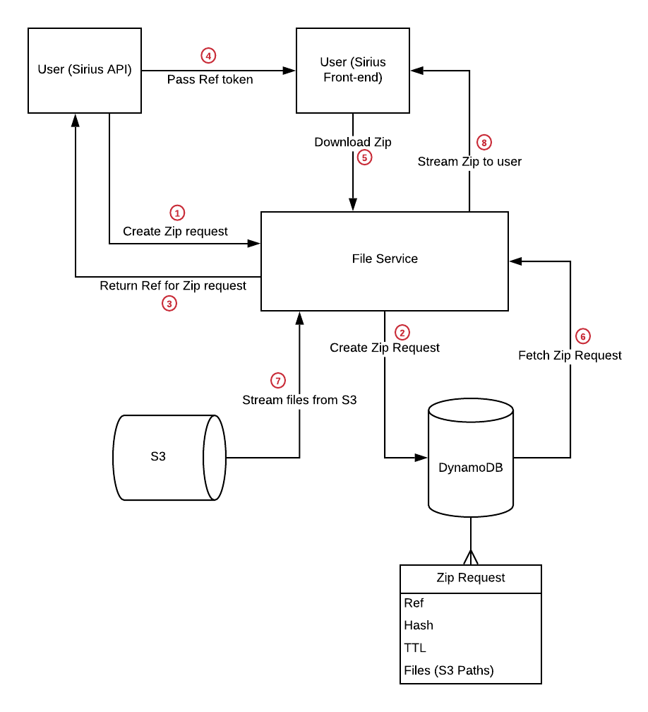

# opg-file-service

Small microservice built with Go to enable users of Sirius to download multiple files from S3.

## Local Development

### Required Tools

 - Docker with docker-compose

### Development environment

Use docker compose commands to build/start/stop the service locally e.g. `docker compose up --build` or `make up` will rebuild and start the service.

By default the local URL is http://localhost:8000/services/file-service, where `/services/file-service` is configured by the `PATH_PREFIX` ENV variable.

### Tests

Run `make test` to execute the test suites and output code coverage for each package.

#### End-to-end tests

Generally they sit in `main_test.go`. The test suite will start up the file service in a go-routine to run tests against it, and therefore all ENV variables required for configuring the service have to be set prior to running the test suite. This is all automated with the `make test` command.

## Swagger docs

Run `make docs` or `make swagger-up` to view swagger docs at http://localhost:8383/

#### Updating swagger docs

Run `make swagger-generate` to update the swagger.yml file

The file service uses [Go Swagger](https://goswagger.io/) to generate the ./swagger.yml file from annotations in the code itself. See ./main.go for examples. [Go Swagger](https://goswagger.io/) is based on [Swagger 2.0](https://swagger.io/docs/specification/2-0/basic-structure/). Be careful not to confuse it with OpenAPI v3.

Another gotcha... Make sure annotations are written with 2 space tabs in order for the parser to work correctly!

## Endpoints

The endpoints and their request/response structure are documented in the [Swagger docs](./docs/openapi/openapi.yml)

- `GET /health-check` - returns a 200 status code if the file service is running
- `POST /zip/request` - Creates a new Zip request and stores it in the database. On success it returns a Reference token that can be used in the `GET /zip/{reference}` endpoint to download the zip.
- `GET /zip/{reference}` - Finds a Zip request by Reference and streams a zip of all files associated with the Zip request.

## Authentication

All requests (except for `health-check` endpoint) are passed through a JWT authentication middleware that performs the following checks:

- JWT token is present in the `Authorization` header in the format: `Authorization: Bearer JWT_GOES_HERE`
- JWT token is valid
- JWT token is not expired
- JWT token is signed with the correct key (`JWT_SECRET` ENV var) using the correct signature method (HMAC-SHA by default)
- JWT token has a `session-data` claim

The middleware will also create a SHA-256 hash of the `session-data` value from the JWT payload, which usually contains an email address. This hash is stored with all Zip requests and is subsequently used for verifying that the user downloading a zip is the same user that created the Zip request in the first place. The salt for this hash is defined in `USER_HASH_SALT` ENV var.

## Diagram

## Environment Variables

| Variable                  | Default                           |  Description   |
| ------------------------- | --------------------------------- | -------------- |
| JWT_SECRET                | MyTestSecret                      | Environment variable used to set the key for verifying JWT tokens, this should be overwritten in an environment |
| USER_HASH_SALT            | ufUvZWyqrCikO1HPcPfrz7qQ6ENV84p0  | Defines what hash to use when hashing user emails, this should match the hash being used on sirius              |
| AWS_DYNAMODB_TABLE_NAME   | zip-requests                      | Table name where zip requests are stored                                                                        |
| AWS_S3_ENDPOINT           |                                   | Used for overwriting the S3 endpoint locally e.g. http://localstack:4566                                        |
| AWS_DYNAMODB_ENDPOINT     |                                   | Used for overwriting the DynamoDB endpoint locally e.g. http://localstack:4566                                  |
| AWS_REGION                | eu-west-1                         | Set the AWS region for all operations with the SDK                                                              |
| AWS_ACCESS_KEY_ID         |                                   | Used for authenticating with localstack e.g. set to "localstack"                                                |
| AWS_SECRET_ACCESS_KEY     |                                   | Used for authenticating with localstack e.g. set to "localstack"                                                |
| PATH_PREFIX               |                                   | Path prefix where all requested will be routed                                                                  |
